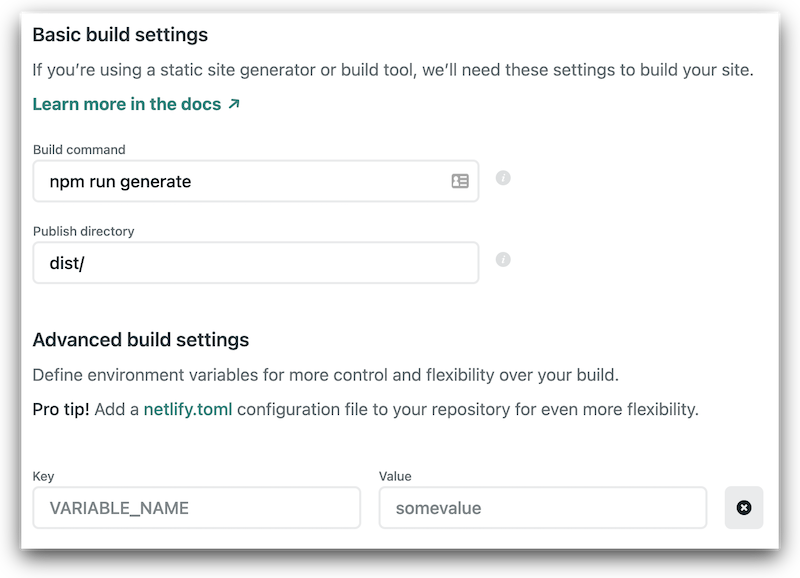

# Nuxt, Strapi, GraphQL

## Setup

**frontend**
`npx create-nuxt-app frontend`

**backend**
`npx create-strapi-app api`

---

## Defining content in Strapi

-   Add a new collection.
-   Add all fields needed for this collection (eg, Article).
-   When saved the server will restart and make 'Article' available from the menu bar.

## Adding content

-   Open the collection and create a new record.
-   When saved the article will be in draft form.
-   Publish to make it available.

## Permission

So a user can access the content via an API you need to configure this.

-   Go to **General &rarr; Settings &rarr; U/P Plugin &rarr; Roles**
    -   Authenticated - uses a JWT.
    -   Public - is unauthenticated.

Using public, select **find** and **find one** to allow GET requests to our Article collection (all records, and a single).

## Test the API

We can now open up Postman and test the API using http://localhost:1337/articles.

## GraphQL

For Strapi this can either be installed via the Marketplace plugin, or on the command line.

`npx strapi install graphql`

After installing on command line, just restart the Strapi server and the GraphQL plugin will show as installed.

Access the GraphQL playgound UI at http://localhost:1337/graphql

```graphql
query {
    articles {
        title
        date
    }
}
```

This return a JSON response from our Articles table, containing the title and date for all articles.

---

## Progress

We have now setup;

-   Nuxt frontend
-   Strapi backend
-   GraphQL working with Strapi

Next we need to connect Nuxt to Strapi so we can make easily make GraphQL API calls.

The following endpoints are now available:

-   /graphql (POST)

-   /articles (GET)

---

## Connecting Nuxt to Strapi

```ssh
cd frontend
npm install @nuxtjs/apollo graphql graphql-tag
```

### 1. Update `nuxt.config.js`

```javascript
modules: [
    '@nuxtjs/apollo'
],

apollo: {
    clientConfigs: {
        default: {
            httpEndpoint: process.env.BACKEND_URL || "http://localhost:1337/graphgl"
        }
    }
}
```

### 2. Create `queries.js`

Add a new directory called `graphql` inside `frontend`, with a file called `queries.js`.

```javascript
import gql from "graphql-tag";

export const allArticlesQuery = gql`
// GraphQL query for all articles
query {
    articles {
        title
        date
    }
}
`;

export const singleArticleQuery = gql`
// GraphQL query for single article
query {
    article(id:1){
        title
        date
    }
}
`;
```

### 3. Update `index.vue`

```javascript
import { allArticlesQuery } from '@/graphql/queries.js'

data() {
    return {
        articles: []
    }
},
apollo: {
    articles: {
        prefetch: true,
        query: allArticlesQuery
    }
}
```

---
## Creating dynamic pages

 `index.vue` can now be updated to have a `v-for` list to loop though all for the content received from the **Articles** `graphQL` call.

 ```html
<div
    v-for="article in articles"
    :key="article.id"
    class="section">
    
    <NuxtLink
        :to="{ path: article.slug, query: { id: article.id } }"
        >{{ article.title }}
    </NuxtLink>
</div>
 ```

With Nuxt.js, you don't need to maintain a `route.js` file, and instead just create a vue file for each route in the `pages` folder. `route.js` is then dynamically generated during the build process.

For dynamic content, start the filename with an underscore such as `_myslug.vue`, and in this case I'm using `_id.vue`.

### Make the GraphQL call dynamic

Our `graphql` call for a single article is currently harcoded to **'id = 1'** and instead we want this to be dependent on the url paramater of `id`.

#### 1. Update `queries.js`

```javascript
export const singleArticleQuery = gql`
    query singleArticleQuery($id: ID!) {
        article(id: $id) {
            id
            title
            date
            body
            description
            slug
        }
    }
`
```

#### 2. Create `_id.vue`
```javascript
import { singleArticleQuery } from '@/graphql/queries'
export default {
    data() {
        return {
            // this caused issues if set to null,
            // and would only work on page reload
            article: [],
        }
    },
    apollo: {
        article: {
            prefetch: true,
            query: singleArticleQuery,
            variables() {
                return {
                    // this is the id from the url
                    id: this.$route.query.id,
                }
            },
        },
    },
}
```
--- 
## Static site generation

For the site to be statically generated using `Nuxt` we need to up `nuxt.config.js` with `target:static`.

The problem with the code above is that `nuxt generate` will return `null` for the `$route.query` object, by design, and will therefore throw an error when trying to generate the articles.

**There are two options**;

* Exclude the article pages using `generate.exclude` in the config file, and setting `generate.fallback` to true. This will exclude the articles from being statically generated, and fallback to an SPA when on the article pages, calling the `graphql` endpoint on each page request.

> This won't be a fully static site though, so will always require a server to be running to grab that data from our database via an API. 

```javascript
generate: {
    fallback: true,
    exclude: [
        /^\/article/, // path starts with /article
    ],
},
```

* Refactor the code so that instead of a query string, we use a `param` for the article id, making the path `my-article-title/[article-id]`. This method will statically generate each of the article pages.

```html
// index.vue
<NuxtLink
    :to="{
        path: 'article/' + article.slug + '/' + article.id,
    }"
    >{{ article.title }}
</NuxtLink>
```
```javascript
// article.vue
apollo: {
    article: {
        prefetch: true,
        query: singleArticleQuery,
        variables() {
            return {
                id: this.$route.params.slug,
            }
        },
    },
},
```
## Almost!
**Although the theory is correct, unfortunately option 2 doesn't appear to work with apollo smart queries yet.**

When testing on Netlify, the `graphql` api will still be called on every page load of article, even though the articles have been statically generated. As soon as you turn off the Strapi server, the page content won't load unless the page is refreshed.

This is a [known issue](https://github.com/nuxt-community/apollo-module/issues/339), and it looks like that `asyncData` needs to be used instead of the `apollo` method for now.

```javascript
async asyncData({ app, params }) {
    const { data } = await app.apolloProvider.defaultClient.query({
        query: singleArticleQuery,
        variables: {
            id: params.slug,
        },
    })
    return {
        article: data.article,
    }
},
```

> This will now statically generate our entire site when deployed, so the database server is only needed during this initial generation.
---
## A note on page fetching

`Nuxt` has smart page fetching built in, where it will prefetch any linked page that is in the viewport, as long as the user isn't on a 2G connection. This means it will be preloaded before the user clicks on a link to save load time.

This clearly has the possible overhead disadvantage of loading lots of routed pages up front that may never be clicked, and can be turned on by adding `no-prefetch` as an option to `NuxtLink`. 

To turn off prefetching globally, this can be done in the `nuxt.config`, and then add a `prefetch` option to any links you wish to ignore this.

```html
<NuxtLink to="/about" prefetch>About page prefetched</NuxtLink>
```

```javascript
export default {
  router: {
    prefetchLinks: false
  }
}
```

## Deploying to Netflify

1. Commit the frontend source to Github.
2. Select the 'New Site from Git' option from Netlify.
3. Choose the 'Continuous deployment' option for Github.
4. The build command is `npm run generate` as we're using `target:static`



5. Under **Advanced build settings** we need to set the URL of the `graphql` API endpoint, which will be explained in the next section.


